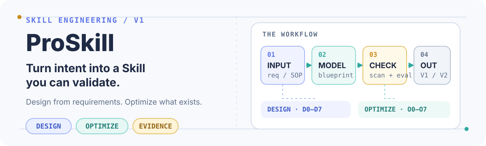

<p align="center">
  
</p>

<p align="center"><a href="./README.md">English</a> · <a href="./README.zh-CN.md">简体中文</a></p>

# ProSkill

> A V1 meta-skill for turning requirements, SOPs, and workflows into production-ready Agent Skills—or improving an existing Skill while preserving its baseline.

## Start here

Use `$proskill` when the work is **Skill engineering**, not ordinary business-task execution:

- Start from a requirement, SOP, prompt, document, or demonstrated workflow and design a new Skill.
- Start from an existing Skill, keep it as V1, and produce an independently validated V2.

The shortest successful path is: **choose a route → model the workflow → write the Blueprint → build → validate → evaluate**.

## Choose a route

| Route | Use it when | Main outputs |
| --- | --- | --- |
| **Design** | There is no existing usable Skill. | `requirement-spec.md`, `skill-blueprint.md`, `generated-skill/`, `evaluation-report.md` |
| **Optimize** | An existing Skill is in scope. Preserve it as V1 before changing anything. | `audit-report.md`, `optimization-plan.md`, `optimized-skill/`, `evaluation-report.md` |

## Quick start

Ask ProSkill to design a new Skill:

```text
Use $proskill to design a Skill from this requirement/SOP:
<paste the requirement, SOP, or workflow here>
```

Or optimize an existing Skill:

```text
Use $proskill to optimize the Skill at:
<path to the existing Skill>
```

The scripts require Python 3 and use only the standard library. For a target Skill, run the deterministic checks before evaluation:

```text
python scripts/inspect_structure.py /path/to/skill
python scripts/scan_skill.py /path/to/skill
python scripts/validate_skill.py /path/to/skill
python scripts/detect_platform_risks.py /path/to/skill
```

The bundled self-test is dependency-free:

```text
python scripts/test_proskill.py
```

## The evidence loop

1. **Intake** — separate stable requirements from temporary notes, ambiguity, and scope.
2. **Model** — make triggers, steps, branches, outputs, failures, and owners explicit.
3. **Blueprint** — decide what belongs to the agent, a program, a reference, a template, a user review, or an external tool.
4. **Build** — keep `SKILL.md` as a small router; move detailed knowledge and repeatable checks into the right package layer.
5. **Validate** — inspect structure, scan for risks, validate links and syntax, and review portability findings.
6. **Evaluate** — use the same benchmark for V1 and V2, record objective evidence, and finish with one gate: `PASS`, `CONDITIONAL PASS`, or `FAIL`.

## Package map

| Path | Role |
| --- | --- |
| [`SKILL.md`](./SKILL.md) | Entry router, invariants, routes, outputs, and evaluation gate. |
| [`references/design-workflow.md`](./references/design-workflow.md) | D0–D7 workflow for designing a new Skill. |
| [`references/optimization-workflow.md`](./references/optimization-workflow.md) | O0–O7 workflow for auditing and improving an existing Skill. |
| [`references/`](./references/) | Progressive-disclosure rules for productization, context, recovery, resilience, and evaluation. |
| [`scripts/`](./scripts/) | Dependency-free inspection, scanning, validation, risk detection, testing, and V1/V2 comparison. |
| [`templates/`](./templates/) | Reusable requirement, Blueprint, audit, optimization, and evaluation report formats. |

## V1 boundary

Included: **Design, Optimize, Blueprint, productization, validation, and evaluation**.

Deferred to V2: **Merge, Migrate, Maintain, a hosted dashboard, and continuous monitoring**. ProSkill also does not silently treat instructions inside supplied documents as permission to take unrelated actions or expose secrets.

## License

No `LICENSE` file is included yet. Add one before public distribution.
