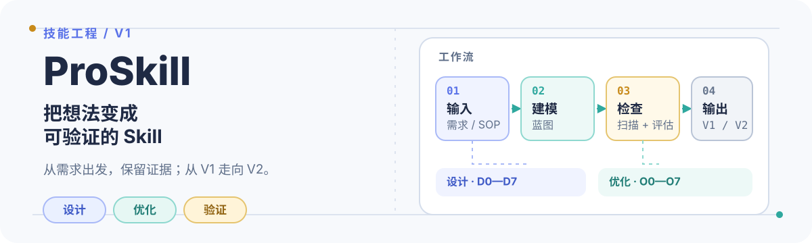

<p align="center">
  
</p>

<p align="center"><a href="./README.md">English</a> · <a href="./README.zh-CN.md">简体中文</a></p>

# ProSkill

> 用于工程化 Agent Skill 的 V1 元技能：把需求、SOP 和工作流转化为生产就绪的 Skill，或在保留基线的前提下改进已有 Skill。

## 从这里开始

当任务是 **Skill 工程化**，而不是普通业务任务执行时，使用 `$proskill`：

- 从需求、SOP、提示词、文档或已演示的工作流出发，设计新的 Skill。
- 从已有 Skill 出发，将其保留为 V1，并产出独立验证过的 V2。

最短成功路径是：**选择路线 → 建模工作流 → 编写 Blueprint → 构建 → 验证 → 评估**。

## 选择路线

| 路线 | 适用场景 | 主要产物 |
| --- | --- | --- |
| **Design（设计）** | 不存在可直接使用的已有 Skill。 | `requirement-spec.md`、`skill-blueprint.md`、`generated-skill/`、`evaluation-report.md` |
| **Optimize（优化）** | 已有 Skill 在范围内。修改前先将它保留为 V1。 | `audit-report.md`、`optimization-plan.md`、`optimized-skill/`、`evaluation-report.md` |

## 快速开始

让 ProSkill 设计一个新的 Skill：

```text
Use $proskill to design a Skill from this requirement/SOP:
<在这里粘贴需求、SOP 或工作流>
```

或者优化已有 Skill：

```text
Use $proskill to optimize the Skill at:
<已有 Skill 的路径>
```

这些脚本需要 Python 3，只使用标准库。对目标 Skill 执行评估前，先运行确定性检查：

```text
python scripts/inspect_structure.py /path/to/skill
python scripts/scan_skill.py /path/to/skill
python scripts/validate_skill.py /path/to/skill
python scripts/detect_platform_risks.py /path/to/skill
```

仓库自带的自测不依赖第三方包：

```text
python scripts/test_proskill.py
```

## 证据闭环

1. **Intake（接收）** — 区分稳定需求、临时记录、歧义和范围。
2. **Model（建模）** — 明确触发条件、步骤、分支、输出、失败行为和责任归属。
3. **Blueprint（蓝图）** — 决定哪些内容由 Agent、程序、参考资料、模板、用户评审或外部工具负责。
4. **Build（构建）** — 让 `SKILL.md` 保持为小型路由器，把详细知识和可重复检查放到合适的包层级。
5. **Validate（验证）** — 检查结构、扫描风险、验证链接与语法，并审阅可移植性问题。
6. **Evaluate（评估）** — 用同一基准测试 V1 和 V2，记录客观证据，并以 `PASS`、`CONDITIONAL PASS` 或 `FAIL` 结束。

## 包结构

| 路径 | 作用 |
| --- | --- |
| [`SKILL.md`](./SKILL.md) | 入口路由、不可妥协的约束、路线、产物和评估门禁。 |
| [`references/design-workflow.md`](./references/design-workflow.md) | 设计新 Skill 的 D0–D7 工作流。 |
| [`references/optimization-workflow.md`](./references/optimization-workflow.md) | 审计和改进已有 Skill 的 O0–O7 工作流。 |
| [`references/`](./references/) | 产品化、上下文、恢复、韧性和评估的渐进式披露规则。 |
| [`scripts/`](./scripts/) | 无依赖的检查、扫描、验证、风险检测、自测和 V1/V2 对比工具。 |
| [`templates/`](./templates/) | 需求、Blueprint、审计、优化和评估报告模板。 |

## V1 边界

已包含：**Design、Optimize、Blueprint、产品化、验证和评估**。

V2 暂不包含：**Merge、Migrate、Maintain、托管 Dashboard 和持续监控**。ProSkill 也不会擅自把用户提供文档中的指令当作执行无关操作或暴露秘密的授权。

## 许可证

当前尚未包含 `LICENSE` 文件。在公开发布前请补充许可证。
